#Lohika Mobile UI Automation Readme

Table of contents
=================
1. [Environment Setup](#environment-setup)
2. [How to run tests locally](#how-to-run-tests-locally)
3. [Identifying mobile elements](#identifying-mobile-elements)
4. [Project overview](#project-overview)
5. [Design patterns](#design-patterns)
6. [Test properties and flags](#test-properties-and-flags)
7. [Additional info](#additional-info)
      * [Class Chain Queries for iOS](#class-chain-queries-for-ios)
      * [Test execution flow](#test-execution-flow)

Environment Setup
=================
#### Setup for running iOS and Android tests
This section describes tools used for automated testing of Android application. Here is a comprehensive list of everything you need on a fresh installation of OSX.

- Homebrew
- Carthage
- Node & NPM
- JDK
- Xcode
- authorize-ios
- ios-deploy
- ideviceinstaller
- ios_webkit_debug_proxy
- Android Studio and Android SDKs
- Appium
- Maven
- Java IDE

#### Install Homebrew
Homebrew is a package management software that will make it much simpler for us to install a few other software.
To install, follow the instructions on this page: [https://brew.sh/](https://brew.sh/)
This step will also install the Xcode Command Line Tools as part of the process.

#### Install Carthage
Carthage is a dependency manager. In our case, it is required by WebDriverAgent.
In terminal, enter the following:
>brew install carthage

#### Install Node & NPM
Node is a javascript run-time environment and npm is the node package manager. We need these because Appium is a node application.
In terminal, enter the following: (this command will install npm as well)
>brew install node

#### Install JDK and set JAVA_HOME
As we’ll be writing our tests in Java, we need the Java Development Kit (JDK)
Download the JDK, jdk-8u181-macosx-x64.dmg, from this link: [http://www.oracle.com/technetwork/java/javase/downloads/jdk8-downloads-2133151.html](http://www.oracle.com/technetwork/java/javase/downloads/jdk8-downloads-2133151.html) .
Then double click the JDK and follow through all the installation steps.
Next, you’ll need to set JAVA_HOME in your .bash_profile.
To do so, first find the location of where the JDK was installed by entering the following into terminal:

>/usr/libexec/java_home --v

The terminal output should be along the lines of

>/Library/Java/JavaVirtualMachines/jdk1.8.0_171.jdk/Contents/Home

Next edit your bash_profile by editing it in vim editor. Type the following into terminal:

>vim ~/.bash_profile

Press the ‘i’ key to enter insert mode then move the cursor a new line and add the following 2 lines

>export JAVA_HOME="path of your java home"
>
>export PATH=$JAVA_HOME/bin:$PATH

Press the ‘esc’ key and then type ‘:wq’ and press enter to save and quit vim. Restart Terminal to pick up the new .bash_profile settings.

#### Install Xcode and Simulators
Launch the Mac AppStore and download/install Xcode.
Once installed, Launch Xcode and select Xcode > Preferences > Components to install the simulators that you might want to test against.

#### Install authorize-ios
authorize-ios is a little utility that pre-authorizes Instruments to run UIAutomation scripts against iOS devices. You need this utility to run tests on real devices
In terminal, enter the following:
>npm install -g authorize-ios

#### Install ios-deploy
ios-deploy is a small utility to install and debug iPhone apps from the command line, without using Xcode.
In terminal, enter the following:
>brew install ios-deploy

#### Install ffmpeg
ffmpeg is required for test run video recording feature.
>brew install ffmpeg

#### Install ideviceinstaller
ideviceinstaller is a tool to interact with the installation_proxy
of an iOS device allowing to install, upgrade, uninstall, archive, restore
and enumerate installed or archived apps. You also need this utility to run tests on real devices.
>brew install ideviceinstaller

**If you are macOS High Sierra or Mojave you may encounter an error involving “invalid active developer path” in which case run the following command in terminal:
>xcode-select --install
>
>sudo xcode-select -r

Then try install ideviceinstaller one more time.

#### Install ios_webkit_debug_proxy
Appium uses this tool to access web views on real iOS devices. In terminal, run the following command
>brew install ios-webkit-debug-proxy

#### Install Android Studio & Android SDKs
We’ll need the Android SDKs next to write and run tests on Android apps and devices. The quickest way to get these installed is via Android Studio.
Download and install Android Studio from [https://developer.android.com/studio/](https://developer.android.com/studio/)
Launch Android Studio and complete the setup process until you reach the welcome page.
From the bottom, select “Configure” > “SDK Manager” > “Android SDK”.

For the tab “SDK Platforms”, select the Android SDK Platform versions that you intent to run tests against.
For the tab “SDK Tools” and ensure the following are selected:

- Android SDK Build-tools (highest version)
- Android SDK Platform-Tools
- Android SDK Tools
- Intel x86 Emulator Accelerator (HAXM installer)
- Android Support Respository
- Google Repository

Click “OK” to install any of the additions that you selected.
Now copy the value of the Android SDK Location at the top of the SDK Manager screen. This is the value that we’ll need to set for ANDROID_HOME in our .bash_profile.
Once again, Type the following into terminal:
>vim ~/.bash_profile

Press the ‘i’ key to enter insert mode then move the cursor a new line and add the following lines

>export ANDROID_SDK=/Users/akosatuchenko/Library/Android/sdkexport
>
>ANDROID_HOME=/Users/akosatuchenko/Library/Android/sdk
>
>export PATH=$JAVA_HOME/bin:/opt/apache-maven/bin:$ANDROID_SDK/emulator:$ANDROID_SDK/platform-tools:$ANDROID_SDK/tools:$ANDROID_HOME/emulator

Make sure you have exact same order as params in the PATH. The params order has an impact on what is used first. If yours is different from what you see above - some of the commands like 'adb' or 'emulator' might not work as expected.
Press the ‘esc’ key and then type ‘:wq’ and press enter to save and quit vim.
Restart terminal to pickup the new .bash_profile then run the following commands to check that it does not throw an error:
>adb
>
>emulator

#### Install Appium
Appium is an open source test automation framework for use with native, hybrid and mobile web apps. It drives iOS, Android and Windows mobile apps using the WebDriver protocol.
In terminal, enter the following:
>npm install -g appium

Alternatively you can download Appium Desktop that would have GIU and Appium UI Inspect tool from: 
[https://github.com/appium/appium-desktop/releases](https://github.com/appium/appium-desktop/releases)

#### Install Maven
Maven is a tool used for building and managing Java-based projects.
In terminal, enter the following:
>brew install maven

Check the maven version by entering this into the terminal:
>mvn -version

Next edit your .bash_profile by adding this line to it (follow the steps using vim above):
>export PATH=/usr/local/Cellar/maven/<you_maven_version>/bin:$PATH

*Be sure to set the version number as per the version you installed instead of <you_maven_version>*

#### Install JAVA IDE
You can go with any java IDE of your choice.
For example IntelliJ IDEA:
[https://www.jetbrains.com/idea/download/](https://www.jetbrains.com/idea/download/)

How to run tests locally
========================
**First of all you need to move all .app and .apk files of application into "app" directory which should exist in root folder of project.
Second requirement is that appium server has to be up and running either via Appium Desktop or from command line.**

If you wold like to run tests locally you have several options how to do it:
- Using IntelliJ IDEA
- Maven with specifying tests in command
- Maven with xml suite file

#### Run test locally using IntelliJ Idea
Open project in IntelliJ IDEA and select menu Run > Edit configurations...  
In Run/Debug Configurations window:  
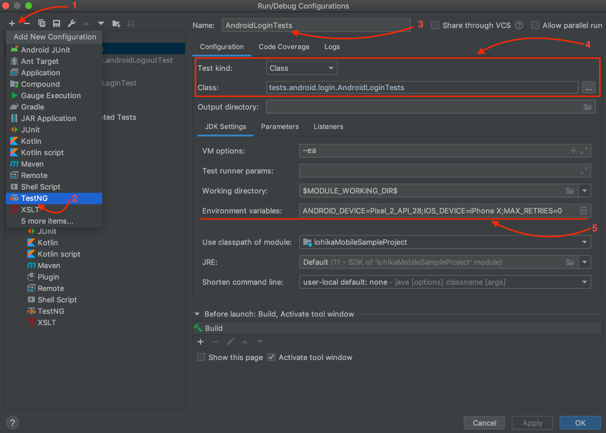

1. Click "+" sign to add new run configuration
1. Select TestNG
1. Specify configuration name
1. Configure which test method/class/suite you want to run
1. Specify test options with environment variables

More details here: [https://www.jetbrains.com/help/idea/run-debug-configuration-testng.html](https://www.jetbrains.com/help/idea/run-debug-configuration-testng.html)

#### Run tests locally using Maven with specifying tests in command
In this case you need to open command line from the root directory of the project (directory where pom.xml file is located) and execute command.  
Example of command:
>mvn test -Dtest="tests.ios.login.IOSLoginTests#iOSLoginTest" -DANDROID_DEVICE="Pixel_2_API_28" -DIOS_DEVICE="iPhone X"

Here is the meaning of command and its params:
- mvn - execute maven command
- test - execute project tests
- -Dtest="tests.ios.login.IOSLoginTests#iOSLoginTest"
- tests.ios.login.IOSLoginTests test class
- '#iOSLoginTest' particular test method name
- -DANDROID_DEVICE="Pixel_2_API_28" -DIOS_DEVICE="iPhone X" - variables you're passing to parametrize test

All parameters passing to maven should be marked with -D , e.g. -DANDROID_DEVICE, -DIOS_DEVICE, etc.
For more details please refer to Maven documentation [https://maven.apache.org/users/index.html#](https://maven.apache.org/users/index.html#)

#### Run tests locally using Maven with xml suite file
In this case we are specifying test suite xml configuration file instead of list of tests with suiteXmlFile parameter all other parameters should be specified in the same way as described above.
Example of command:
>mvn test -DsuiteXmlFile="./xmlSuites/ios/LoginTests.xml" -DANDROID_DEVICE="Pixel_2_API_28" -DIOS_DEVICE="iPhone X"

If you would like to run several suites then you need to provide suites' paths trough -Dsurefire.suiteXmlFiles parameter.  
Example of command:
>mvn test -Dsurefire.suiteXmlFiles="./xmlSuites/ios/LoginTests.xml","./xmlSuites/android/LoginTests.xml" -DANDROID_DEVICE="Pixel_2_API_28" -DIOS_DEVICE="iPhone X"

Suite Xml file contains configurations for TestNG and list of tests to run.
Example of xml suite file:

```xml
<?xml version="1.0" encoding="UTF-8"?>
<!DOCTYPE suite SYSTEM "http://testng.org/testng-1.0.dtd" >
<suite name="IOS Login Tests" thread-count="1">
  <test name="RA Tests" enabled="true">
    <classes>
      <class name="tests.ios.login.IOSLoginTests" />
    </classes>
  </test>
</suite>
```

Please refer to TestNG documentation to get more details on TestNG xml suite files: [https://testng.org/doc/documentation-main.html#testng-xml](https://testng.org/doc/documentation-main.html#testng-xml)


Identifying mobile elements
===========================
Download and install the Appium Desktop application and use the Appium Desktop Inspector functionality.  
(Note that Appium desktop also contains the Appium server that we previously - at [Environment Setup](#environment-setup) section installed with terminal — but it behaves slightly differently so we are using that mostly for inspection purposes)  
Launch the Appium Desktop app, select “Simple” and then click the “Start Server” button  
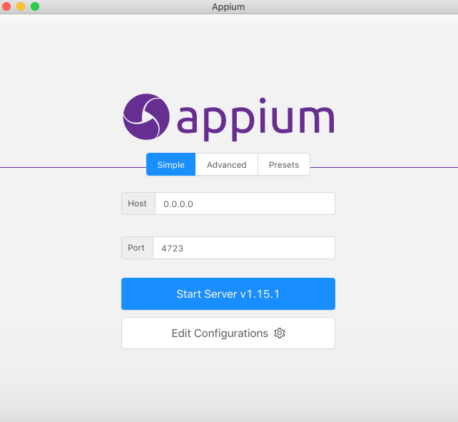

Select the search icon to Start Inspector Session                       
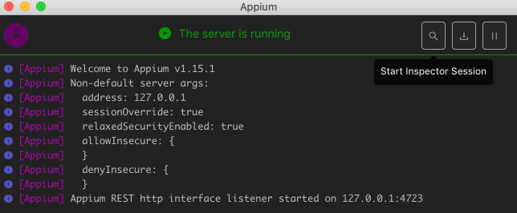

Enter desired capabilities for each platform:  
For iOS:  
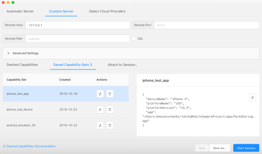

For Android:  
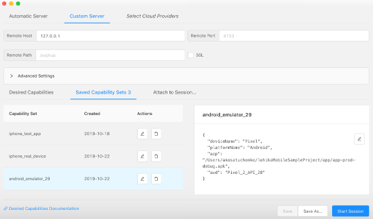


Click start session and the inspector will present itself and launch the application on the device.  
You can now easily navigate the application and with the “Tap”, “Send Keys” or “Clear” action buttons on the inspector.  
You can also view either the element’s ID or xpath identify the element

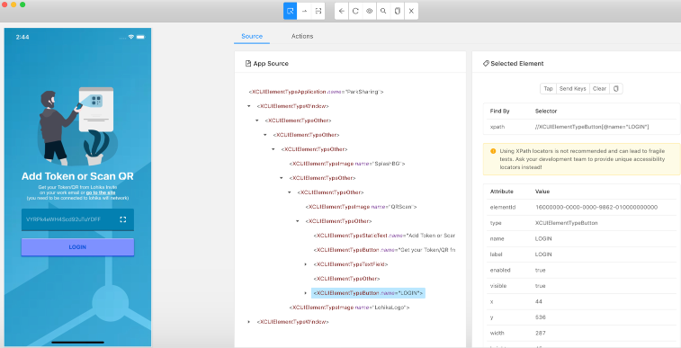

In project Login button element looks like this:  
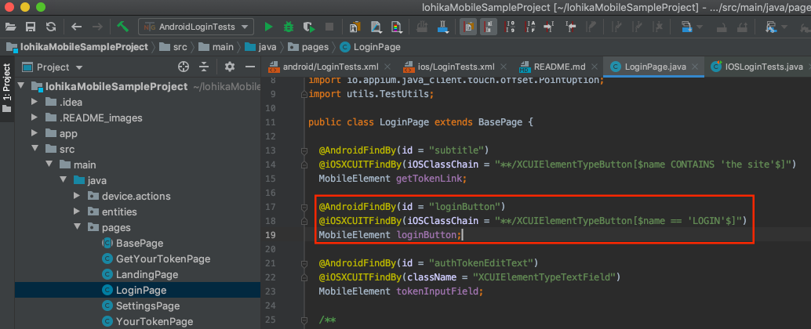

In LoginPage class there is variable 'loginButton' of type MobileElement.  
We tell appium to find element by name (accessibility) which is 'LOGIN'.  
Since we are using PageObject factory we are setting this via annotation        
``@iOSXCUITFindBy(iOSClassChain = "**/XCUIElementTypeButton[$name == 'LOGIN'$]")``

Alternatively we could find loginButton element like this:          
``@iOSXCUITFindBy(accessibility = "LOGIN")``
**Note:** never use xpath for iOS. It is very slow. 
You should always use **iOSClassChain** for ios if there is no id/name/accessibility available.

You can check if your locator works in Appium inspector using 'Search for element' feature.  
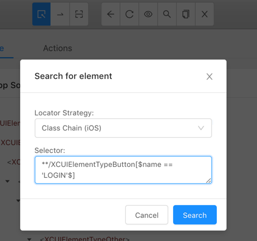

Select your locator strategy, selector and click "Search"               
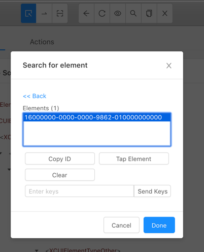

If at least one element is found you will see it search results.


Project overview
================
Mobile automation project have standard structure of classic Maven project.  
All dependencies, plugins and project configurations are in pom.xml file that is in the root folder of project.  

Directories description:
- style - folder with code style configs
- src - directory to store code resources
- main - for main code base
- tests - for test classes
- suites - directory with TestNG xml suites for Android and iOS

Additional directories:
- app - place to store application installation files (.app and .apk)
- test_reports - place where test execution results will be stored(created automatically).

**src/main/java directory**
Main code base. It contains main code for the automation framework and has following structure:

- entities - entities for real device support
- device.actions - implementation of hardware and software phone's actions(like swipes, scrolls, key events). It has implementations for iOS and Android phones.
- utils - utils that are used for actions and interactions with system and framework
- pages - objects that represent pages and screens in the application and interaction with this pages/screens

**Pages directory**
This directory contains code description of all Activities in the mobile application using PageObject design pattern.  
All PageObjects are located in the root of page and contain *Page in a class name.

**src/test/java directory**  
This directory is used for test layer of framework and contains all the tests and test data
Tests classes are located in java/tests directory and are distinguished by platform and test category.
java/resources folder contains test images and test properties.

Design patterns
===============
Some programing and automation design patterns are used for better scalability, readability and supportability.
Following design patterns are in use:
- Page Object pattern
- Strategy pattern
- Template Method pattern
- Factory pattern

#### Page Object pattern
Instead of having each test fetch elements directly and being fragile towards UI changes, the Page Object Pattern introduces what is basically a decoupling layer.

You create an object that represents the UI you want to test, which could be a whole page or a significant part of it.  
The responsibility of this object is to wrap Activity elements and encapsulate interactions with the UI, meaning that this is where all calls to Appium will go.  
This is where most WebElements or MobileElements are. And this is the only place you need to modify when the UI changes.  
This figure illustrates the pattern:  
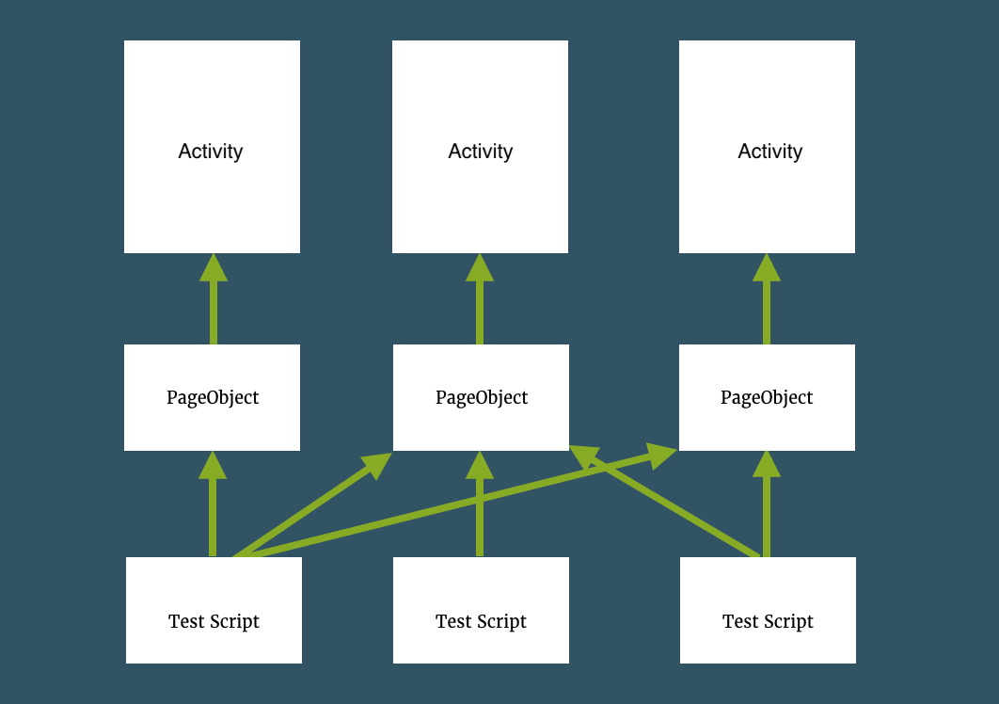

The convention is that all PageObject classes should have with word 'Page' in the end. For example: **LoginPage**.
PageObject classes describe Activities and divide them into elements, interaction methods and service methods.  
Example of PageObject:  
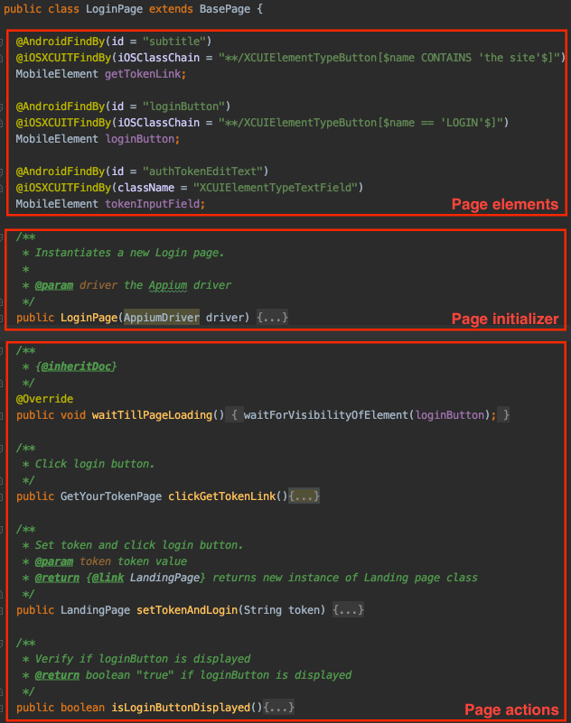

- Page elements - is representation of actual activity
- Page initializer - class' constructor where we call loadPage method which will initialize page elements using PageFactory. PageObject's constructor takes Appium driver as parameter
- Page actions - are methods that are interacting with page elements and service methods like waitTillPageLoading() which are used by framework.

Application activity described by PageObject class above:  

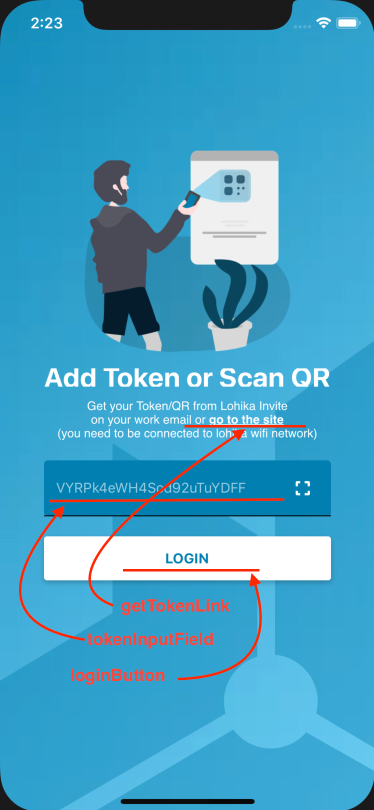

PageObject classes could be instantiated directly in a test layer or instances could be taken as results of execution PageObject's methods taking advantage of 'Chain Invocation' design pattern.
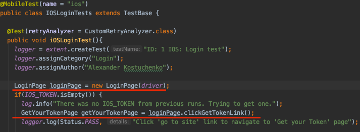

#### Strategy pattern
Strategy pattern (also known as the policy pattern) is a behavioral software design pattern that enables selecting an algorithm at runtime. Instead of implementing a single algorithm directly, code receives run-time instructions as to which in a family of algorithms to use.

#### Template Method pattern
The template method is a method in a superclass, usually an abstract superclass, and defines the skeleton of an operation in terms of a number of high-level steps. These steps are themselves implemented by additional helper methods in the same class as the template method.
In the framework this pattern used for handling "page loaded" statement in PageObjects and placed in BasePage class.

#### Factory pattern
Factory method pattern uses factory methods to deal with the problem of creating objects without having to specify the exact class of the object that will be created.
Factory pattern used in the framework for creating AppiumDriver(DriverFactory class) and managing Device Actions(DeviceActions class).

Test properties and flags
=========================
#### How to use test properties
Test properties are stored in test.properties file that is located at <git_root>/src/test/resources directory
This file contains different configuration and test data like name and password of test user or file extension for test application:
```
user_one=akosatuchenko
user_one_password=
app_package=com.lohika.parksharing
app_activity=com.lohika.parking.main.MainActivity
android_app_keyword=.apk
ios_app_keyword=.app
android_device_name=Pixel
ios_platform_version=13.3
android_platform_name=Android
ios_platform_name=iOS
android_automation_name=uiautomator2
ios_automation_name=XCUITest
session_start_timeout=240
```

This data is retrieved by TestConstants class that contains two nested classes: Users, Constants
These classes have very similar structure. Here is the Users class:
```
  public static final class Users {
    @Getter
    private static final String userOne = prop.getProperty("user_one");

    @Getter
    private static final String userOnePassword = prop.getProperty("user_one_password");

  }
```

User name is retrieved from the value that corresponds to user_one key in the property file.
This value can be retried in any test by calling a static getter (get method) that is generated by 'lombok' library using @Getter annotation.  
For example you can get user name in any test like this:
>TestConstants.Users.getUserOne()

When using lombok library this line:
```
@Getter
private static final String userOne = prop.getProperty("user_one");
```

Is the same to this:
```
private static final String userOne = prop.getProperty("user_one");
public static String getUserOne() { return userOne; }
```

More info at: 
[https://projectlombok.org/](https://projectlombok.org/)

To make generated getters and setters get recognised by your IDE install lombok plugin for your IDE.  
For example for intelliJ IDEA you can do this by going to Preferences -> Plugins and search for lombok  
Click on "Search in repositories" link in the search results.  
Install lombok plugin  
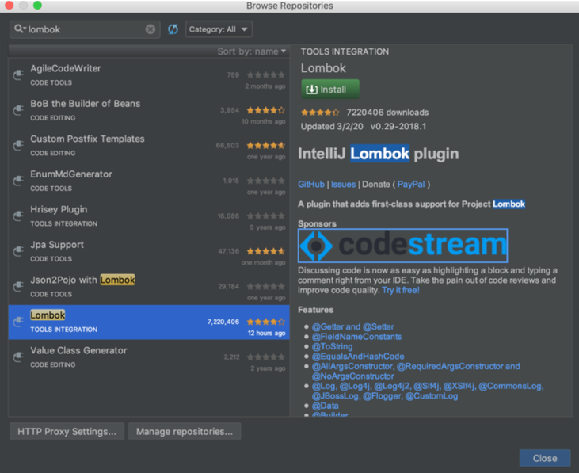

#### How to add new property?
If you want to add new User or a Test constant first you need to add new key value pair to test.properties file that is located at <git_root>/src/test/resources directory.  
For example add new line to test.properties file for new user name:
>new_user_name=new_user_email@gmail.com

Then add new line in Users class to retrieve that new property's value:
```
@Getter
private static final String newUserName = prop.getProperty("new_user_name");
```
That's it. In any test you can access this value like this:
>TestConstants.Users.getNewUserName()

#### How to use test flags?
Test flags are usually passed to test code via environment variables by using -D.  
For example this is how test is executed from command line for android platform:
> mvn clean test -DsuiteXmlFile=$suiteXmlFile -DANDROID_DEVICE=$ANDROID_DEVICE

You can see at least two different params passed to test: suiteXmlFile and ANDROID_DEVICE
Here is full list of test flags and params that you can pass to test code:

- suiteXmlFile - sets an test ng xml test suite file that specifies which tests to run. Suite files reside in <project_root>/suites directory
- ANDROID_DEVICE - sets Android emulator name that will be used to run tests. Defaults to "Pixel_2_API_28" if not set
- IOS_DEVICE - sets iOS simulator name that will be used to run tests. Defaults to "iPhone X" if not set
- MAX_RETRIES - sets max retries before test will be marked as failed. Defaults to "2"
- RECORD_ALL_RUNS - if set to "true" all test run videos will be saved to <git_root>/extent_reports. If set to "false" only videos and screenshots of failed tests will be saved. Default value is "false"

Additional info
===============
#### Class Chain Queries for iOS
**Never use xpath for iOS. It works super slow. Use iOSClassChain if there is no id/name/accessibility instead.**

**Examples:**
```
@iOSXCUITFindBy(iOSClassChain = "**/XCUIElementTypeNavigationBar[$name == 'ParkSharing.HomeView'$]/XCUIElementTypeButton")
```
Selects the child button of the navigation bar with name 'ParkSharing.HomeView'.

```
@iOSXCUITFindBy(iOSClassChain = "**/XCUIElementTypeCollectionView/XCUIElementTypeCell[`visible == true`]")
```
Selects all visible cells who are 'children' of the first collection view.

```
@iOSXCUITFindBy(iOSClassChain = "**/XCUIElementTypeCell[$type == 'XCUIElementTypeStaticText' AND name == 'Mine'$]")
```
Selects all cells, which have at least one descendant of type 'static text' with name 'Mine'

```
@iOSXCUITFindBy(iOSClassChain = "**/XCUIElementTypeCollectionView/XCUIElementTypeCell[2]/XCUIElementTypeStaticText")
```
Selects the element of type 'static text', which is a direct child of the 2nd cell, which is a direct child of collection view element

```
@iOSXCUITFindBy(iOSClassChain = "**/XCUIElementTypeButton[$type == 'XCUIElementTypeImage' AND name CONTAINS 'icnHome'$]")
```
Select all button, which have at least one descendant image with name contains 'icnHome'

Look at [https://github.com/facebookarchive/WebDriverAgent/wiki/Class-Chain-Queries-Construction-Rules](https://github.com/facebookarchive/WebDriverAgent/wiki/Class-Chain-Queries-Construction-Rules) for more info.


#### Test execution flow
All UI tests should extend TestBase class
TestBase class contains  setup and cleanup methods that are always executed before and after all tests.  
Those methods are marked by TestNG annotations:
```
@BeforeSuite
public void beforeSuite()
```
This method is executed once before all tests "test suite" and it does the following:
- outputs values of all flags and test properties to the output console log.
- creates empty html test run report that will be updated after each test run
- setups testing device

```
@BeforeClass
public void beforeClass()
```
This method is executed before each Test class.  
It initialises Appium driver that is later used in all Page classes to find and interact with mobile elements in the application
```
@BeforeMethod(alwaysRun = true)
public void beforeMethod(Method method) 
```
This method is executed before each test and it performs following actions:
- outputs current test name to the console
- starts video recording of a device's screen
- resets application so that all tests will always have the same starting point when user is not logged in

```
@AfterMethod
public void afterMethod()
```
This method is executed after each test and it does following:
- depending on the value of RECORD_ALL_RUNS flag video of the executed test is saved to <git_root>/test_reports directory
- html report is updated at <git_root>/test_reports directory
```
@AfterSuite
public void afterSuite()
```
This method is executed once after all tests are executed.
It quits Appium driver and saves all updates that have been made to the test report.
